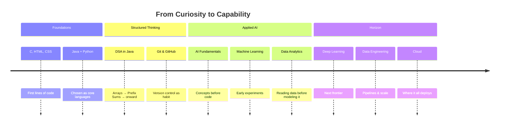
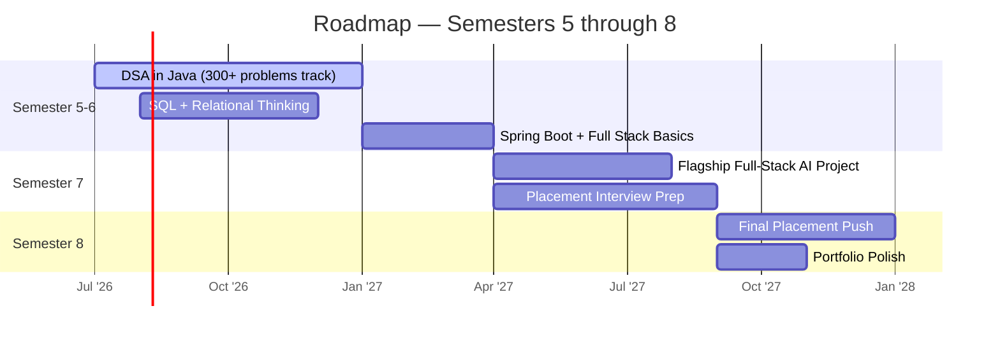

<div align="center">


<br/>

<a href="https://github.com/YOUR_USERNAME">
  
</a>

</div>

<br/>

<div align="center">


</div>

<br/>


<br/>

## ◉ Mission Control

<table width="100%">
<tr>
<td width="60%" valign="top">

```yaml
identity:
  name: Karunyah
  degree: B.Tech, Information Technology
  institution: K. Ramakrishnan College of Engineering (KRCE), Trichy
  status: Second Year → Entering Third Year
  country: India

trajectory:
  target_role: Software Engineer
  specialization:
    - Artificial Intelligence
    - Data Analytics
    - Full Stack Development

operating_principle: >
  Build in public. Ship honestly.
  No inflated claims — only what's real,
  labeled exactly as it is.
```

</td>
<td width="40%" valign="top">

<div align="center">

### 🎯 Current Objective

**Placement-Ready Engineer**
by Semester 7-8

<br/>

`[■■■■■■□□□□]` **60%**
*DSA Foundations*

`[■■■□□□□□□□]` **30%**
*Full Stack Systems*

`[■■□□□□□□□□]` **20%**
*AI / ML Depth*

</div>

</td>
</tr>
</table>

<br/>

## ◉ Currently Engineering

<div align="center">

| Domain | What I'm Doing | Signal |
|:---|:---|:---:|
| **Data Structures & Algorithms** | Working through core patterns — Arrays, Prefix Sums, and building toward graphs & DP | 🟢 Active |
| **Java** | Primary language for placement-grade problem solving | 🟢 Active |
| **Python** | Kept warm for AI/ML experimentation | 🟢 Active |
| **SQL** | Query fundamentals → relational thinking | 🟡 In Progress |
| **Git & GitHub** | Version control as a daily habit, not an afterthought | 🟢 Active |
| **AI Fundamentals** | Bridging classical CS with applied ML thinking | 🟡 In Progress |
| **Machine Learning** | Early-stage, concept-first approach | 🟠 Early Stage |
| **Data Analytics** | Understanding data before modeling it | 🟡 In Progress |

</div>

<br/>

## ◉ Learning Radar

<div align="center"> 
Java
                      ●
                      |
          Python  ●   |   ● SQL
                  \   |   /
                   \  |  /
  C ●───────────────ME───────────────● HTML/CSS
                   /  |  \
                  /   |   \
    JavaScript ●      |      ● AI Fundamentals
                      |
                      ●
                Machine Learning

    ● = Active Orbit        Distance from center = Depth
    </div>

<table width="100%">
<tr>
<th align="center" width="25%">🟣 Core</th>
<th align="center" width="25%">🔵 Applied</th>
<th align="center" width="25%">⚪ Exploring</th>
<th align="center" width="25%">⚫ Future Orbit</th>
</tr>
<tr valign="top">
<td>

- Java
- Python
- Data Structures
- Algorithms

</td>
<td>

- SQL
- Git / GitHub
- HTML / CSS
- JavaScript

</td>
<td>

- AI Fundamentals
- Machine Learning
- Data Analytics

</td>
<td>

- Spring Boot
- React
- Deep Learning
- Data Engineering
- Cloud

</td>
</tr>
</table>

<br/>

## ◉ AI Journey

<div align="center">



</div>

<br/>

## ◉ Future Tech Stack

<div align="center">

**Languages**

     

**Tools I use today**

   

**Where I'm heading**

   

</div>

<br/>

## ◉ Code Laboratory

<div align="center">
<sub>Every card is labeled with its real status — nothing here is dressed up to look further along than it is.</sub>
</div>

<br/>

<table width="100%">
<tr>
<td width="50%" valign="top">

### 🚨 Disaster Management System
**`Java`**

A system concept focused on coordinating disaster response — resource tracking, alerting, and reporting logic.

`Status: Work in Progress`

</td>
<td width="50%" valign="top">

### 🎓 Student Database Management System
**`Java`**

Structured storage and retrieval of student records — CRUD operations as the backbone of relational thinking.

`Status: Work in Progress`

</td>
</tr>

<tr>
<td width="50%" valign="top">

### 📱 Social Media Queue Management
**`Concept`**

A queue-based system to model how social platforms handle post scheduling and content flow.

`Status: Work in Progress`

</td>
<td width="50%" valign="top">

### 🎂 Birthday Reminder System
**`Automation`**

Small-scale automation project — track dates, trigger reminders, remove the "forgot again" problem.

`Status: Work in Progress`

</td>
</tr>

<tr>
<td width="50%" valign="top">

### ⛑️ Smart Helmet IoT
**`Idea`**

A safety-first IoT concept — sensor-driven helmet that detects impact and alerts contacts automatically.

`Status: Currently Designing`

</td>
<td width="50%" valign="top">

### ❤️ Driver Heart Attack Detection System
**`Concept`**

Vitals-monitoring concept aimed at detecting cardiac distress in drivers and triggering an emergency response.

`Status: Work in Progress`

</td>
</tr>

<tr>
<td width="50%" valign="top">

### 🖥️ Host Network Monitoring System
**`Networking`**

A concept for tracking host health and traffic patterns across a local network.

`Status: Work in Progress`

</td>
<td width="50%" valign="top">

### 🔍 AI Patent Search Idea
**`AI / NLP`**

An idea for using NLP to search and cluster patent documents by semantic similarity, not just keywords.

`Status: Currently Designing`

</td>
</tr>

<tr>
<td width="100%" valign="top" align="center">

### 🧮 LeetCode Solutions Repository
**`DSA` `Java`**

Running archive of solved problems — patterns, edge cases, and the reasoning behind each approach, not just accepted code.

`Status: Work in Progress`

<br/>

<a href="https://github.com/YOUR_USERNAME"></a>

</td>
</tr>
</table>

<br/>

## ◉ DSA Arena

<div align="center">

### 🧠 The Grind, Tracked Honestly


<br/><br/>

`[■■■□□□□□□□] 30 / 300+`

**Target: 300+ problems solved by 7th semester**

</div>

<table width="100%">
<tr>
<th align="center">Phase</th>
<th align="center">Topic</th>
<th align="center">Status</th>
</tr>
<tr>
<td align="center">Phase 1</td>
<td align="center">Arrays — Foundations</td>
<td align="center">✅ Complete</td>
</tr>
<tr>
<td align="center">Phase 2</td>
<td align="center">Prefix Sum</td>
<td align="center">✅ Complete</td>
</tr>
<tr>
<td align="center">Phase 2+</td>
<td align="center">Two Pointers / Sliding Window</td>
<td align="center">🟡 Upcoming</td>
</tr>
<tr>
<td align="center">Phase 3</td>
<td align="center">Recursion & Backtracking</td>
<td align="center">⚪ Planned</td>
</tr>
<tr>
<td align="center">Phase 4</td>
<td align="center">Trees & Graphs</td>
<td align="center">⚪ Planned</td>
</tr>
<tr>
<td align="center">Phase 5</td>
<td align="center">Dynamic Programming</td>
<td align="center">⚪ Planned</td>
</tr>
</table>

<br/>

## ◉ Building Tomorrow

<div align="center">



</div>

<br/>

## ◉ Innovation Vault

<div align="center">

<table>
<tr>
<td align="center" width="25%">

🏆<br/>
**NPTEL**<br/>
Cloud Computing

</td>
<td align="center" width="25%">

🏆<br/>
**NPTEL**<br/>
Human Behaviour

</td>
<td align="center" width="25%">

🧪<br/>
**CodeAlpha**<br/>
AI/NLP Internship

</td>
<td align="center" width="25%">

📌<br/>
**Applied**<br/>
Internship Programs

</td>
</tr>
</table>

</div>

<br/>

## ◉ My Engineering Philosophy

<div align="center">


</div>

<br/>

<blockquote align="center">
I'd rather show ten honest lines of "work in progress"<br/>
than one polished lie.
</blockquote>

<br/>

## ◉ GitHub Pulse

<div align="center">


<br/>


<br/><br/>


</div>

<br/>

<details>
<summary><b>🏅 Trophy Case (click to expand)</b></summary>
<br/>
<div align="center">

</div>
</details>

<br/>

<details>
<summary><b>🐍 Contribution Snake (click to expand)</b></summary>
<br/>
<div align="center">

</div>
</details>

<br/>

## ◉ Signal Board

<div align="center">


</div>

<br/>

## ◉ Let's Connect

<div align="center">

<a href="https://linkedin.com/in/YOUR_LINKEDIN">

</a>
<a href="https://github.com/YOUR_USERNAME">

</a>
<a href="mailto:YOUR_EMAIL">

</a>
<a href="https://YOUR_PORTFOLIO">

</a>
<a href="https://YOUR_RESUME">

</a>

</div>

<br/>

<div align="center">
<sub>Replace every <code>YOUR_USERNAME</code>, <code>YOUR_LINKEDIN</code>, <code>YOUR_EMAIL</code>, <code>YOUR_PORTFOLIO</code>, <code>YOUR_RESUME</code>, and <code>YOUR_LEETCODE_USERNAME</code> placeholder above with your real links before publishing.</sub>
</div>

<br/>


<div align="center">
<sub>Built line by line — no template, no shortcuts, no exaggeration.</sub>
</div>
